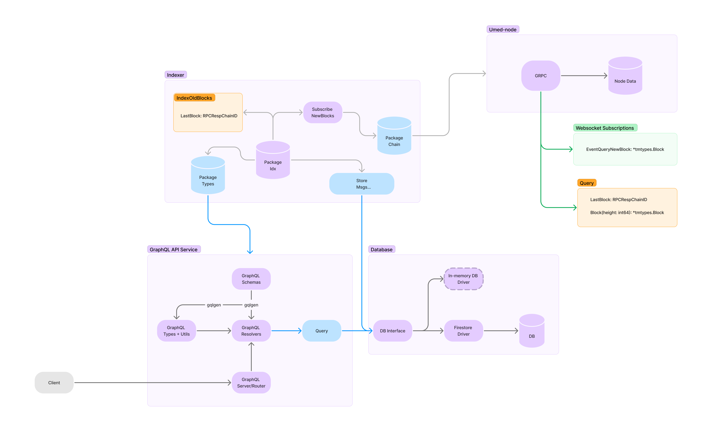

# `Umeed` Indexer

Indexer for umee blockchain

The idea for this indexer is to connect to only one specific node and connect with this node for retrieving block informations.
It creates an websocket connection and subscribe to every new block being produced, indexing the needed transacitons.
At the same time it asks for old blocks lets say from 3 months ago to start indexing the transacitons from old blocks.

The indexer controls the indexed blocks by msg type. Every different message type has its own blocks interval which were already indexed
by using the following structures:

```go
type CosmosMsgIndexed struct {
  ProtoMsgName  string                  `json:"protoMsgName" firestore:"protoMsgName"`
  BlocksIndexed []*BlockIndexedInterval `json:"blocksIndexed" firestore:"blocksIndexed"`
}

type BlockIndexedInterval struct {
  IdxFromBlockHeight int `json:"idxFromBlockHeight" firestore:"idxFromBlockHeight"`
  IdxToBlockHeight   int `json:"idxToBlockHeight" firestore:"idxToBlockHeight"`
}
```

It is possible to control which block heights were already indexed and at which block it should start querying the node for indexing new transactions.

[Figma](https://www.figma.com/file/wczpxDSXqNR4qDeIhxJYOn/Umeed-Indexer?type=whiteboard&node-id=0%3A1&t=kB2pywLn2uhyqCcP-1)



## Graphql

[Graphql](https://graphql.org/) is mostly being used to generate the structures to easy store into and read from the database. But also to leverage the query language available for query Indexer stored data.

### API

This repository also serves an Graphql API with queries related to the msgs indexed in the database, like to retrieve all the liquidation messages that the `Borrower` was an specific address.

## Msgs

The cosmos-msgs being indexed are imported directly from the [umee blockchain](https://github.com/umee-network/umee), but are not being stored directly into the database,
they are parsed as the types defined in the [graphql schema](./graph/schemas/schema.graphqls) for better control of what needs to be stored into the database and also for building queries and retrieve information with graphql.

## Umeed Node

The umeed node to connect the indexer should probably be one which has the bigger amount of blocks stored in their storage, this would allow
the indexer to go back into the past to index old blocks transactions.

If the indexer request an older block than what the node has available, it will get the response from the node which contains the last block available on
his storage and the indexer will start to request blocks from that specific block height to start indexing. ex.:

- Node Response for querying the block of height 1.

```shell
RPC error -32603 - Internal error: height 1 is not available, lowest height is 7942001"
```

- This msg would be parsed and the indexer would start asking if needed only blocks after the height `7942001`.

## Database

The Database is under an [interface](https://github.com/umee-network/umeed-indexer/blob/8cb9059d55b50b69b93cb3300bbb3417b7d1c09f/database/db.go#L24) and could be choosen any database that implements this interface.

At the moment, [firestore](https://firebase.google.com/docs/firestore) is being used to store the indexer data.

## How to Run

- Start local firestore emulator

```shell
make run-firestore
```

- Start the indexer

```shell
make run
```

### API - Graphql

- if the api is run with the flag `--api`, you can access the graphql playground -> http://localhost:8080/ and query for liquidate msgs

#### Operation

```graphql
query Query($borrower: String!) {
  getLiquidateMsgs(borrower: $borrower) {
    blockHeight
    blockTimeUnix
    msgLeverageLiquidate {
      borrower
      liquidator
      maxRepay
      repayDenom
      rewardDenom
    }
    msgLiquidate {
      borrower
      liquidator
      repayment
      rewardDenom
    }
    protoMsgName
    txHash
  }
}
```

#### Variables

```json
{
  "borrower": "umee10xnqv49h7hh0gfspl7pq6w5nfqtkvj4ru0ekd9"
}
```

#### Result

```json
{
  "data": {
    "getLiquidateMsgs": [
      {
        "blockHeight": 9063675,
        "blockTimeUnix": 1698960400,
        "msgLeverageLiquidate": null,
        "msgLiquidate": {
          "borrower": "umee10xnqv49h7hh0gfspl7pq6w5nfqtkvj4ru0ekd9",
          "liquidator": "umee143yuzruftl89237ysg8zk0rlpy30dqrj6x9l2v",
          "repayment": "8767811ibc/ED07A3391A112B175915CD8FAF43A2DA8E4790EDE12566649D0C2F97716B8518",
          "rewardDenom": "ibc/6B49A789937D4E50BF01F0F50DDEDF5C1103EDF01306B7021BDF23BDE65D99BA"
        },
        "protoMsgName": "umee.leverage.v1.MsgLiquidate",
        "txHash": "26849e073f66dac8a5d9b1527d1514af6d86f2689909474a7586cfacfca7405a"
      }
    ]
  }
}
```
